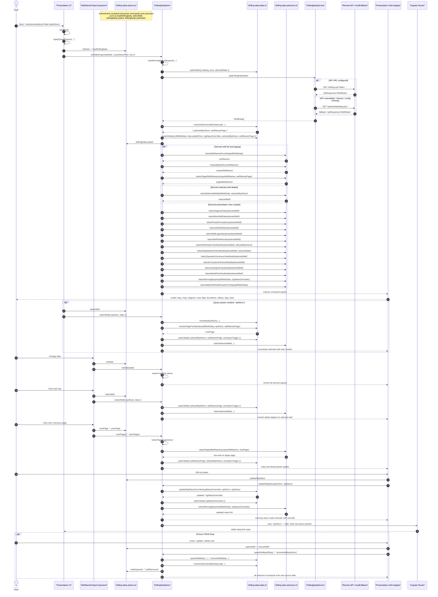

# Drilling Data Sequence Diagram

This diagram shows the current `presentation` screen flow from UI interactions into `DrillingDataStore`, state updates, selectors, actions/events naming, and `DrillingDataService`.

