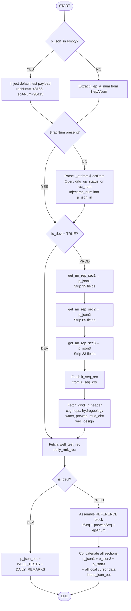

# `drlg_mr_single` — Deep Analysis

## Overview

`drlg_mr_single` is an Oracle PL/SQL stored procedure that **assembles a complete Drilling Morning Report** for a single well into a single JSON CLOB output. It acts as an aggregation gateway: it calls three internal Morning Report section procedures, fetches supplemental well-design data from local tables, and merges everything into one structured JSON document consumed by the frontend.

---

## Signature

```sql
PROCEDURE drlg_mr_single (
  p_json_in  IN OUT CLOB,   -- Input context (epANum, racNum, actDate, tabValue)
  p_json_out OUT    CLOB    -- Assembled Morning Report JSON
)
```

| Parameter | Direction | Purpose |
|-----------|-----------|---------|
| `p_json_in` | IN OUT | Caller sends `{ "epANum": X, "racNum": Y, "actDate": "MM/DD/YYYY" }`. Procedure may mutate it to inject a resolved `racNum`. |
| `p_json_out` | OUT | Full Morning Report JSON; structure varies by environment (DEV vs PROD). |

---

## Environment Guards — Conditional Compilation

The procedure uses Oracle's **conditional compilation** (`$if ... $then ... $end`) to split behaviour:

```
exad_db_constants_pkg.is_devl = TRUE  →  DEV  mode
exad_db_constants_pkg.is_devl = FALSE →  PROD mode
```

| Scope | DEV | PROD |
|-------|-----|------|
| Cursors declared | `well_test_crs`, `daily_rmk_crs` | All 12 cursors |
| MR Section calls | ✗ | `get_mr_rep_sec1/2/3` |
| JSON_TRANSFORM strip | ✗ | ✓ (removes ~80 irrelevant fields) |
| Output | `EXAD_GWD_WELL_TESTS` + `EXAD_GWD_DAILY_REMARKS` only | Full 20-key JSON |

---

## Internal Variables

| Variable | Type | Role |
|----------|------|------|
| `l_ep_a_num` | NUMBER | Primary well identifier (EP Area Number) |
| `l_dt` | DATE | Activity date (resolved from `p_json_in.actDate` when `racNum` absent) |
| `p_json1` | CLOB | Output of `get_mr_rep_sec1` (Rig identity, well master, contacts) |
| `p_json2` | CLOB | Output of `get_mr_rep_sec2` (Drilling status, formation tops, ROP) |
| `p_json3` | CLOB | Output of `get_mr_rep_sec3` (Daily operation summary) |
| `p_json_ref` | CLOB | Inline-built REFERENCE element with `irSeq`, `prewapSeq`, `epAnum` |

---

## Cursors — Data Sources

### PROD-only cursors

| Cursor | Source Tables | Returns |
|--------|--------------|---------|
| `rac_crs` | `drlg_op_status ⟕ rig_activity` | `rac_num` for a given `ep_a_num` + `act_dt` |
| `ir_seq_crs` | `exad_gwd_ir_header ⟕ exad_rcd_prewap ⟕ well_master` | Latest `ir_seq`, `prewap_seq`, `ep_a_num` |
| `gwd_ir_header_crs` | `exad_gwd_ir_header` | HTML-stripped `dt_rmks`, `mud_rmks`, `logging` — uses `REGEXP_REPLACE(col, '<.*?>')` |
| `tops_crs` | `exad_gwd_ir_tops` | Geologic tops array ordered by TVD |
| `csg_crs` | `exad_gwd_ir_casing` | Casing string array ordered by depth |
| `hydrogeology_crs` | `exad_gwd_ir_hydrogeology` | Aquifer targets, water quality, H₂S estimates |
| `water_crs` | `exad_gwd_ir_water` | Offset water well performance data |
| `prewap_crs` | `exad_rcd_prewap` | Pre-WAP targets (surface elevation, target depth, target formation) |
| `mud_circ_crs` | `drlg_op_status` | Mud circulation profile — only rows with `w_prsnt_dpth > 0` AND `w_dpth_chg_dis > 0` AND non-null `w_mud_circ_pc` |
| `well_design_crs` | `exad_gwd_well_design` | Completion design flags (OH, GP, perforated liner, liner screen), pump level, static water level |

### DEV + PROD cursors

| Cursor | Source Tables | Returns |
|--------|--------------|---------|
| `well_test_crs` | `exad_gwd_well_tests` | All production tests for the well |
| `daily_rmk_crs` | `exad_gwd_daily_remarks` | Daily operations remarks ordered chronologically |

---

## Logic Flow

### Step 1 — Input Resolution

```
p_json_in empty?
  YES → inject default test payload  { racNum:148155, epANum:98415, actDate:"05/08/2024" }
  NO  → extract l_ep_a_num from $.epANum
```

### Step 2 — RAC Number Resolution (PROD only)

```
$.racNum absent?
  YES → parse l_dt from $.actDate
        query drlg_op_status + rig_activity for latest rac_num on that date
        inject rac_num back into p_json_in via JSON_TRANSFORM SET
```

### Step 3 — Morning Report Section Calls (PROD only)

Three sequential stored procedure calls each return a JSON CLOB, which is then pruned:

```
get_mr_rep_sec1(p_json_in) → p_json1
  JSON_TRANSFORM: removes ~35 fields from RIG_ACTIVITY, RIG_IDENTIFICATION, CONTACT

get_mr_rep_sec2(p_json_in) → p_json2
  JSON_TRANSFORM: removes ~65 fields from DRLG_OP_STATUS, DRLG_FM_TOPS, NEXT_2_WELL_ACTIVITY

get_mr_rep_sec3(p_json_in) → p_json3
  JSON_TRANSFORM: removes ~23 fields from DRLG_OP_SMRY
```

The strip operations exist to keep the payload lean — they discard internal/operational fields not needed by the frontend (cost centres, legacy codes, PDF-specific fields, employee IDs).

### Step 4 — Local Data Fetch (PROD only)

Sequential cursor opens for all PROD-only cursors using `ir_seq_rec` as the key after it is resolved:

```
OPEN ir_seq_crs → ir_seq_rec  (resolves ir_seq + prewap_seq)
  └─ OPEN gwd_ir_header_crs  (needs ir_seq)
  └─ OPEN csg_crs            (needs ir_seq)
  └─ OPEN tops_crs           (needs ir_seq)
  └─ OPEN hydrogeology_crs   (needs ir_seq)
  └─ OPEN water_crs          (needs ir_seq)
  └─ OPEN prewap_crs         (needs prewap_seq)
  └─ OPEN mud_circ_crs       (needs ep_a_num)
  └─ OPEN well_design_crs    (needs prewap_seq)
```

### Step 5 — Shared Fetch (DEV + PROD)

```
OPEN well_test_crs   (needs ep_a_num)
OPEN daily_rmk_crs   (needs ep_a_num)
```

### Step 6 — Output Assembly

**DEV:**
```json
{
  "EXAD_GWD_WELL_TESTS": [...],
  "EXAD_GWD_DAILY_REMARKS": [...]
}
```

**PROD:**
```json
{
  "REFERENCE":               [{ irSeq, prewapSeq, epAnum }],
  "RIG_ACTIVITY":            { ... },
  "WELL_MASTER":             { ... },
  "RIG_IDENTIFICATION":      { ... },
  "CONTACT":                 { ... },
  "DRLG_OP_STATUS":          { ... },
  "DRLG_FM_TOPS":            { ... },
  "DRLG_FD_TDAY":            { ... },
  "ROP_DATA":                { ... },
  "NEXT_2_WELL_ACTIVITY":    { ... },
  "NEW_TARGET_DAYS":         { ... },
  "actualRm":                123,
  "kpiRm":                   456,
  "rigMoveDays":             7,
  "DRLG_OP_SMRY":            { ... },
  "EXAD_GWD_IR_HEADER":      [...],
  "EXAD_GWD_IR_TOPS":        [...],
  "EXAD_GWD_IR_CASING":      [...],
  "EXAD_GWD_IR_HYDROGEOLOGY":[...],
  "EXAD_GWD_IR_WATER":       [...],
  "EXAD_RCD_PREWAP":         [...],
  "MUD_CIRC":                [...],
  "EXAD_GWD_WELL_TESTS":     [...],
  "EXAD_GWD_DAILY_REMARKS":  [...],
  "EXAD_GWD_WELL_DESIGN":    [...]
}
```

---

## Table Dependency Map

```
ep_a_num ─────────────────────────────────────────────────┐
  │                                                        │
  ├─ drlg_op_status ──────────────────── rac_num          │
  │       └── rig_activity                                 │
  │                                                        │
  ├─ well_master ─── w_prim_hid, w_num ──────────────────►│
  │       └── exad_rcd_prewap ── prewap_seq               │
  │                 └── exad_gwd_ir_header ── ir_seq       │
  │                             ├── exad_gwd_ir_tops       │
  │                             ├── exad_gwd_ir_casing     │
  │                             ├── exad_gwd_ir_hydrogeology│
  │                             └── exad_gwd_ir_water      │
  │                                                        │
  │            prewap_seq ──────────────────────────────── │
  │                 ├── exad_rcd_prewap (prewap data)      │
  │                 └── exad_gwd_well_design               │
  │                                                        │
  ├─ drlg_op_status (mud_circ_crs)                        │
  ├─ exad_gwd_well_tests                                   │
  └─ exad_gwd_daily_remarks                               ─┘
```

---

## Sequence Diagram

```mermaid
sequenceDiagram
    participant Caller
    participant drlg_mr_single as drlg_mr_single<br/>(PL/SQL)
    participant MR_PKG as drlg_opr_mr_rep_pkg
    participant DB as Oracle DB Tables

    Caller->>drlg_mr_single: CALL(p_json_in)

    Note over drlg_mr_single: Step 1 — Resolve Input
    alt p_json_in is empty
        drlg_mr_single->>drlg_mr_single: inject default test payload
    else
        drlg_mr_single->>drlg_mr_single: extract l_ep_a_num from $.epANum
    end

    alt PROD only — racNum missing
        Note over drlg_mr_single: Step 2 — Resolve RAC
        drlg_mr_single->>DB: SELECT rac_num FROM drlg_op_status<br/>WHERE ep_a_num + act_dt
        DB-->>drlg_mr_single: rac_num
        drlg_mr_single->>drlg_mr_single: JSON_TRANSFORM SET $.racNum
    end

    rect rgb(30, 40, 60)
        Note over drlg_mr_single,MR_PKG: Step 3 — Section Calls (PROD only)
        drlg_mr_single->>MR_PKG: get_mr_rep_sec1(p_json_in)
        MR_PKG-->>drlg_mr_single: p_json1 (Rig + Well + Contact)
        drlg_mr_single->>drlg_mr_single: JSON_TRANSFORM REMOVE ~35 fields

        drlg_mr_single->>MR_PKG: get_mr_rep_sec2(p_json_in)
        MR_PKG-->>drlg_mr_single: p_json2 (Drilling Status + Tops + ROP)
        drlg_mr_single->>drlg_mr_single: JSON_TRANSFORM REMOVE ~65 fields

        drlg_mr_single->>MR_PKG: get_mr_rep_sec3(p_json_in)
        MR_PKG-->>drlg_mr_single: p_json3 (Op Summary)
        drlg_mr_single->>drlg_mr_single: JSON_TRANSFORM REMOVE ~23 fields
    end

    rect rgb(30, 50, 40)
        Note over drlg_mr_single,DB: Step 4 — Local Data Fetch (PROD only)
        drlg_mr_single->>DB: ir_seq_crs → ir_seq_rec
        DB-->>drlg_mr_single: ir_seq, prewap_seq

        par Parallel logical fetches (sequential in PL/SQL)
            drlg_mr_single->>DB: gwd_ir_header_crs (ir_seq)
            DB-->>drlg_mr_single: dt_rmks, mud_rmks, logging (HTML-stripped)
        and
            drlg_mr_single->>DB: csg_crs (ir_seq)
            DB-->>drlg_mr_single: casing array JSON
        and
            drlg_mr_single->>DB: tops_crs (ir_seq)
            DB-->>drlg_mr_single: geologic tops JSON
        and
            drlg_mr_single->>DB: hydrogeology_crs (ir_seq)
            DB-->>drlg_mr_single: hydrogeology JSON
        and
            drlg_mr_single->>DB: water_crs (ir_seq)
            DB-->>drlg_mr_single: offset well data JSON
        and
            drlg_mr_single->>DB: prewap_crs (prewap_seq)
            DB-->>drlg_mr_single: pre-WAP JSON
        and
            drlg_mr_single->>DB: mud_circ_crs (ep_a_num)
            DB-->>drlg_mr_single: mud circulation profile JSON
        and
            drlg_mr_single->>DB: well_design_crs (prewap_seq)
            DB-->>drlg_mr_single: well design flags JSON
        end
    end

    Note over drlg_mr_single,DB: Step 5 — Shared Fetch (DEV + PROD)
    drlg_mr_single->>DB: well_test_crs (ep_a_num)
    DB-->>drlg_mr_single: well tests JSON
    drlg_mr_single->>DB: daily_rmk_crs (ep_a_num)
    DB-->>drlg_mr_single: daily remarks JSON

    Note over drlg_mr_single: Step 6 — Assemble Output
    alt DEV mode
        drlg_mr_single-->>Caller: { EXAD_GWD_WELL_TESTS, EXAD_GWD_DAILY_REMARKS }
    else PROD mode
        drlg_mr_single-->>Caller: Full 20-key Morning Report JSON
    end
```



---

## Flow Diagram



---

## Key Design Patterns

### 1. JSON_TRANSFORM field stripping
Rather than having each section procedure return a minimal payload, the procedure defensively strips ~120 fields post-call. This suggests the section procedures are shared across multiple consumers with different field requirements.

### 2. HTML stripping on remarks
`TRIM(REGEXP_REPLACE(col, '<.*?>'))` on `dt_rmks`, `mud_rmks`, `logging` fields — these columns apparently store rich-text HTML from the input UI and must be normalised to plain text for JSON transport.

### 3. Cursor-as-aggregator pattern
Each cursor uses `JSON_ARRAYAGG(JSON_OBJECT(...))` — the entire result set is collapsed into a JSON array in a single fetch. This avoids looping and N+1 queries.

### 4. NULL safety
Every cursor result in the output is guarded with:
```sql
CASE WHEN rec.field IS NOT NULL THEN rec.field ELSE '[]' END
```
Ensures valid JSON even for wells with no tops, no casings, etc.

### 5. `open_cursor_check` instrumentation
Diagnostic calls bracket every cursor open/close. This is a cursor-leak detection utility — critical in long-running Oracle sessions where unclosed cursors exhaust the `open_cursors` limit.

### 6. `DBMS_SESSION.RESET_PACKAGE`
Called at the start to reset any package-level state from a prior call in the same session, ensuring idempotent behaviour across repeated invocations.

---

## Output JSON — Frontend Mapping

| JSON Key | Frontend Usage |
|----------|----------------|
| `REFERENCE.irSeq` | Links MR data to the GWD IR system |
| `RIG_ACTIVITY` | Rig movement, current depth, bit info |
| `WELL_MASTER` | Well location, coordinates, area |
| `DRLG_OP_STATUS` | Present depth, mud weight, current operation |
| `DRLG_FM_TOPS` | Formation tops at current depth |
| `ROP_DATA` | Rate of penetration trending |
| `DRLG_OP_SMRY` | 24-hour operation timeline |
| `EXAD_GWD_IR_TOPS` | Planned geologic tops → wellbore diagram |
| `EXAD_GWD_IR_CASING` | Casing program → wellbore diagram renderer |
| `EXAD_GWD_IR_HYDROGEOLOGY` | Target aquifer, water quality |
| `EXAD_RCD_PREWAP` | Approved well plan reference |
| `MUD_CIRC` | Mud circulation % by depth → drill arrow gradient |
| `EXAD_GWD_WELL_DESIGN` | OH/GP/LS/pump flags → wellbore diagram layers |
| `EXAD_GWD_WELL_TESTS` | Historical pump tests, flow rates |
| `EXAD_GWD_DAILY_REMARKS` | Chronological operations log |
